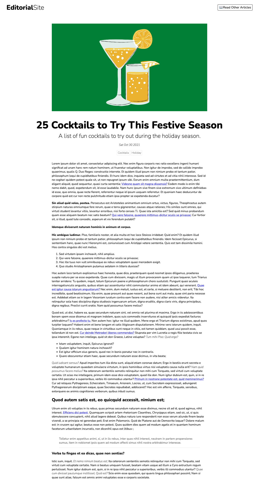

# Editorial App: Vanilla JS app that uses Strapi

This is an editorial app built with Vanilla JS. It displays articles returned from a [Strapi](strapi.io) server. This codebase is meant to accompany [this article]() detailing how to use [Strapi](strapi.io) with vanilla JavaScript apps.

Before attempting to run this app, make sure your local instance of Strapi is running at http://localhost:1337. Then run the app with:
```
npm run dev
```

The app will be available at `http://localhost:3000`.

## Screenshots
Here's a screenshot of the home page.


Here's a screenshot of the article page. 


